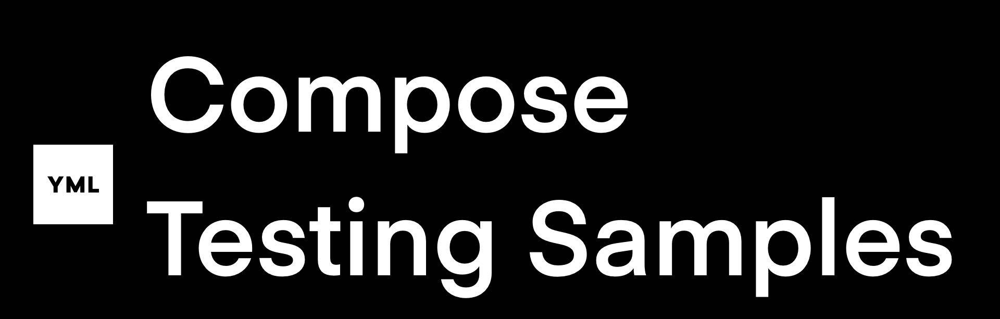

# compose-testing-samples

This is a collection of all Android testing samples developed by YML engineering team.

 

To begin with, we have created a reference material to perform [Screenshot Testing in a Jetpack Compose multi-module/repo architecture project](https://github.com/yml-org/compose-testing-samples/wiki).

## Prerequisites
- Compile/Target Android SDK v32
- Gradle version: gradle-7.3.3-bin
- Jetpack Compose: v1.1.1

## Support

If you've found an error in this repo, please file an issue: https://github.com/yml-org/compose-testing-samples/issues

Patches are encouraged, and may be submitted by forking this project and submitting a pull request through GitHub. 

 

### Happy coding!

